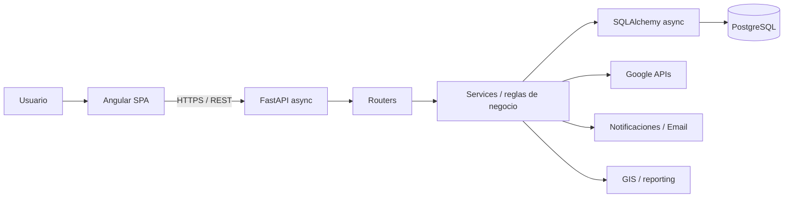

# DEAS CENTRAL

**Engineering Case Study · ERP/CRM/GIS para operaciones de seguridad física · Desarrollo asistido por IA con gobernanza**

DEAS CENTRAL es una plataforma empresarial construida para centralizar clientes, personal operativo, riesgos, actividad, documentos y trazabilidad en una sola fuente de verdad. Combina **Angular standalone + FastAPI async + PostgreSQL** con seguridad por capas y un flujo multi‑agente donde la IA acelera análisis y ejecución, pero **no tiene autoridad autónoma sobre producción**.

> **Portafolio público sanitizado.** Este repositorio muestra arquitectura, decisiones y aprendizajes. Código productivo, credenciales, URLs internas, datos personales y documentación operacional sensible permanecen privados.

---

## Qué problema resuelve

Las operaciones de seguridad física suelen crecer alrededor de hojas de cálculo, documentos aislados, seguimiento manual y conocimiento distribuido entre áreas. Eso dificulta responder con una única fuente confiable quién gestiona un cliente, qué personal está asignado, qué documentos vencen, qué cambió y quién lo autorizó.

DEAS CENTRAL aborda esa fragmentación con:

- **PostgreSQL como fuente de verdad** para datos de negocio.
- **Perfiles 360°** de clientes y personal operativo.
- **CRM, operación y GIS** integrados.
- **Auditoría y ciclos de aprobación** para acciones sensibles.
- **Automatizaciones controladas** para sincronización, vencimientos, notificaciones y correo.

El objetivo no fue crear otro dashboard, sino convertir procesos dispersos en flujos verificables.

---

## Transferibilidad a contextos empresariales

Aunque nació en seguridad física, DEAS CENTRAL resuelve patrones comunes a cualquier plataforma donde los cambios tienen consecuencias reales:

- **Fuente de verdad central:** frontend reactivo, reglas e invariantes en backend.
- **Autorización granular:** roles, scopes, ownership y controles de base de datos.
- **Integraciones desacopladas:** APIs externas sin trasladarles decisiones de negocio.
- **Ciclos de aprobación:** validación previa para cambios críticos.
- **Trazabilidad operacional:** auditoría como patrón arquitectónico, no solo compliance.
- **Migraciones controladas:** backup, revisión, rollback previsto y validación posterior.

Estos patrones son transferibles a **fintech, logística, health-tech, gov-tech, seguros y SaaS B2B**.

---

## Arquitectura en números

**Línea base auditada del repositorio** — fotografía técnica, no métricas comerciales:

| Área | Línea base |
|---|---:|
| Frontend | 16 áreas/feature directories Angular |
| Backend | 19 módulos de routing API |
| Servicios | 38 módulos de servicio |
| Modelos | 26 módulos SQLAlchemy |
| Schemas | 21 módulos Pydantic |
| Migraciones | 42 migraciones Alembic |
| Seguridad BD | 26 tablas auditadas con RLS habilitado |
| Roles | 9 roles con permisos diferenciados |

### Métricas verificables

| Métrica | Evidencia sanitizada |
|---|---|
| Cobertura RLS | **26/26 tablas del inventario auditado** |
| Superficie backend | **19 routers + 38 servicios** |
| Migraciones | **42 Alembic** inventariadas |
| Gobierno de cambios con IA | **Compuerta humana obligatoria** antes de migraciones, merge, push o acciones destructivas |
| Preservación de historial | Datos de negocio se inactivan, archivan o anulan; hard-delete restringido |
| Auditoría destructiva | Política explícita de trazabilidad para operaciones destructivas de negocio |

No se publican porcentajes de productividad, concurrencia ni ahorro de tiempo que no hayan sido medidos formalmente.

### Arquitectura de aplicación



**Principio central:** Angular representa estado e interacción; autorización, scopes, invariantes y lógica de negocio permanecen en FastAPI.

---

## Stack técnico

| Capa | Tecnología | Enfoque |
|---|---|---|
| Frontend | Angular 17.3 | Standalone, lazy loading, TypeScript strict, Signals |
| UI | SCSS + Tailwind | Design system con tokens reutilizables |
| Backend | FastAPI + Python 3.11 | Async, router → service, validación estricta |
| Datos | PostgreSQL + SQLAlchemy 2.0 | asyncpg, Alembic, RLS |
| Validación | Pydantic v2 | Contratos explícitos |
| Hosting datos | Supabase | PostgreSQL + storage |
| GIS / analítica | Leaflet + ECharts | Mapas y KPIs operativos |
| Integraciones | Google APIs + Email | Sheets, Drive, Calendar y correo desde backend |
| Deploy | Railway + Vercel | Backend containerizado + SPA |

---

## 🔒 Seguridad como requisito de arquitectura

- **JWT en cookie httpOnly**; no se persiste el token en `localStorage`.
- **CSRF double-submit** para operaciones mutantes.
- **bcrypt** y política centralizada de contraseñas.
- **Fernet** para tokens OAuth almacenados por backend.
- **Roles + scopes + ownership** validados en servidor.
- **RLS habilitado en 26/26 tablas del alcance auditado** y revocación de grants directos donde correspondía.
- **Audit logs / activity logs** para trazabilidad.
- **Soft-delete, inactivación y anulación** para preservar historial.
- **Checklist pre-migración**: backup, upgrade/downgrade, RLS/grants y validación posterior.
- Secretos, dumps y CSV con PII **no se versionan**.

Los hallazgos P0 identificados durante el hardening fueron corregidos dentro del alcance auditado. Eso **no equivale** a declarar que un sistema real sea invulnerable.

---

## 🤖 IA como sistema de ingeniería

El diferencial no es “usar IA para programar”, sino integrarla con **roles, límites, evidencia y compuertas de aprobación**.

```text
Necesidad / incidente / cambio
        ↓
Contexto + reglas + alcance
        ↓
ChatGPT     → Engineering Lead / coordinación
OpenCode    → ejecución acotada
Claude Code → seguridad / arquitectura / pre-merge
Codex       → análisis o tarea delimitada
        ↓
Tests + build + diff + seguridad
        ↓
Compuerta humana
        ↓
Commit / merge / deploy autorizado
```

### Reglas de gobernanza

1. Ningún agente trabaja directamente sobre `main`.
2. Migraciones, push, merge y cambios destructivos requieren autorización explícita.
3. Los prompts operativos definen **CONTEXTO / TAREA / ARCHIVOS / REGLAS / NO HACER / REPORTAR**.
4. Los agentes no reciben secretos productivos.
5. Cada cambio relevante produce evidencia: preflight, diff, tests/build y revisión posterior.
6. Si una afirmación no puede demostrarse, queda **pendiente de confirmar**.

### Ejemplo concreto: auditoría y hardening de RLS

**Problema:** comprobar sistemáticamente qué tablas sensibles estaban cubiertas por Row-Level Security sin ejecutar cambios ciegos sobre una base production-like.

**Workflow:**

1. El Engineering Lead definió inventario, archivos, controles y evidencia esperada.
2. Un agente inspeccionó modelos, migraciones y documentación para detectar discrepancias.
3. Se prepararon verificaciones explícitas contra PostgreSQL; la IA no obtuvo autoridad autónoma para modificar producción.
4. El resultado se revisó antes de autorizar hardening.
5. Las correcciones se validaron y documentaron.

**Resultado verificable:** la auditoría confirmó **26 tablas del inventario con RLS habilitado** y luego se reforzó la exposición mediante revocación de grants directos donde correspondía.

El valor no está en atribuir a la IA un ahorro de tiempo no medido, sino en exigir que cada afirmación termine respaldada por **inspección, consulta verificable o evidencia de configuración**.

---

## Componentes demostrables

- **GIS y riesgo:** Leaflet para clientes, cobertura y análisis geográfico.
- **Cliente 360:** contratos, estudios de seguridad, seguimientos, pólizas, documentos e historial.
- **CRM:** Kanban comercial y sincronización controlada con Google Sheets.
- **Vigilantes:** ciclo de vida, asignaciones y transferencias con reglas backend.
- **Notificaciones y vencimientos:** pipeline orientado a eventos y alertas operativas.
- **Reportes:** PDF backend con ReportLab y exportaciones estructuradas.

---

## Decisiones de ingeniería relevantes

**Backend como fuente de verdad.** Los permisos de frontend son UX; identidad, rol, scope y reglas se vuelven a validar en servidor.

**PostgreSQL como motor canónico.** Supabase hospeda la base, pero FastAPI + SQLAlchemy + Alembic preservan portabilidad.

**Retirar complejidad cuando no aporta valor.** La arquitectura de correo evolucionó para eliminar una capa intermedia cuando eventos, destinatarios, templates y logs ya pertenecían al backend.

**No borrar historia operacional.** Clientes, vigilantes, leads e incidencias siguen ciclos de inactivación, archivo o anulación.

**Separar ejecución y revisión de IA.** Un agente que genera un cambio no es la única fuente de validación para cambios de alto impacto.

---

## Lecciones aprendidas

- Más capacidad de generación con IA exige **mejores gates**, no menos.
- Autorización en frontend nunca reemplaza controles del servidor.
- Una migración es un cambio productivo y merece backup, revisión y rollback previsto.
- ADRs, mapas de repo y checklists reducen improvisación entre humanos y agentes.
- Eliminar una dependencia puede mejorar una arquitectura si no se pierde control.
- “Funciona” no es un quality gate: hacen falta evidencia, tests/build, diff y validación funcional.

---

## Roadmap público

- [ ] Profundizar pruebas de integración/E2E y observabilidad.
- [ ] Ampliar automatización de reportes y notificaciones.
- [ ] Evolucionar almacenamiento documental hacia opciones más gobernables.
- [ ] Evaluar WhatsApp como interfaz operativa autorizada.
- [ ] Aplicar IA generativa solo con revisión humana y trazabilidad.

---

## Uso responsable de este portafolio

Todos los ejemplos, diagramas y cifras mostrados aquí están **sanitizados**. No contienen URLs productivas, credenciales, datos de clientes, usuarios reales, secretos operativos ni configuración privada de infraestructura.

**Por qué está público así:** el objetivo es mostrar pensamiento de ingeniería, decisiones arquitectónicas, gobierno de cambios y capacidad de ejecución **sin exponer el sistema que opera**.

---

### Tecnologías principales

`Angular` · `TypeScript` · `FastAPI` · `Python` · `SQLAlchemy` · `Pydantic` · `PostgreSQL` · `Supabase` · `Alembic` · `Leaflet` · `ECharts` · `ReportLab` · `Google APIs` · `Railway` · `Vercel`
